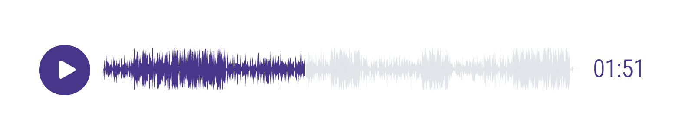

# ClippPlayer

An audio player widget with a waveform 

[](https://www.npmjs.com/package/clipp-player) [](https://standardjs.com) [](https://circleci.com/gh/dschoon/clipp-player)




#####Demo: https://dschoon.github.io/clipp-player/


## Install

```bash
npm install --save clipp-player
```

## Usage

```jsx
import React from 'react'

import ClippPlayer from 'clipp-player'
import mySong from './audio/mySong.mp3';

class App extends React.Component {
  render () {
    return (
      <ClippPlayer src="{mySong}" />
    )
  }
}
```

## License

MIT © [Dan Schoonmaker](https://danielschoonmaker.com) [(github)](https://github.com/dschoon)
